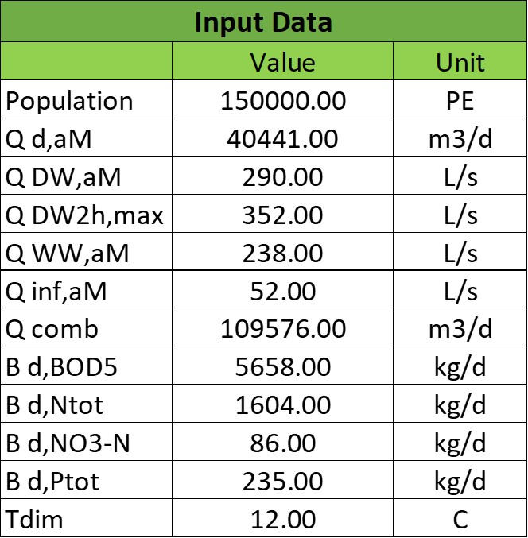
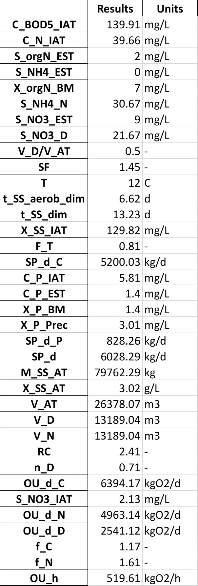

# Wastewater Treatment Plant Design Package

<div style="text-align:center">

[](images/WWTP.jpg)

*<small>Fig 1. Aerial photo of Kuryanovo wastewater treatment plant in
Moscow, Russia. (source: Alexander Savin 2018).</small>*
</div>


***
Developed by [Camila Alvarado](https://www.linkedin.com/in/camila98/), 
[Luis Granda](https://www.linkedin.com/in/luis-emilio-granda/), and
[Lucas Tardio](https://www.linkedin.com/in/lucas-tardio-ascarrunz-48a70a158/) 
(CLL Group)
***

## Code Description

### Purpose

An executable python package that can calculate dimensions for the main
parts of a wastewater treatment plant using inflow quantities and
chemical properties.

The main parts and its functions are:

1. [Primary sedimentation tank](https://www.robuschi.com/en-gb/industries/wastewater-treatment/primary-sedimentation#:~:text=Primary%20sedimentation%20removes%20suspended%20solids,in%20the%20liquid%20waste%20stream)
for settleable solids separation
2. [Activated sludge tank](https://en.wikipedia.org/wiki/Activated_sludge#:~:text=The%20activated%20sludge%20process%20for,from%20the%20clear%20treated%20water)
for organic matter removal through aeration and filtration
3. [Secondary sedimentation tank](https://www.robuschi.com/en-cn/industries/wastewater-treatment/secondary-sedimentation)
for biomass separation through settlement

<div style="text-align:center">

[](images/flow_scheme.jpg)

*<small>Fig 2. Basic flow scheme of a wastewater treatment plant.
(source: Gujer 1999).</small>*
</div>

Inflow quantities and chemical properties include:

|     Abbreviation      | Description                               |      Units      |
|:---------------------:|:------------------------------------------|:---------------:|
|   Q<sub>d,aM</sub>    | Daily inflow, annual mean                 | m<sup>3</sup>/d |
|   Q<sub>DW,aM</sub>   | Dry weather flow as annual mean           |       L/s       |
| Q<sub>DW,2h,max</sub> | Maximum dry weather flow as 2 hourly mean |       L/s       |
|   Q<sub>WW,aM</sub>   | Wastewater flow as annual mean            |       L/s       |
|  Q<sub>inf,aM</sub>   | Infiltration water flow as annual mean    |       L/s       |
|   Q<sub>comb</sub>    | Combined wastewater flow                  | m<sup>3</sup>/d |
|  B<sub>d,BOD5</sub>   | Daily mean biochemical oxygen demand      |      kg/d       |
|  B<sub>d,Ntot</sub>   | Daily mean total nitrogen load            |      kg/d       |
|  B<sub>d,NO3-N</sub>  | Daily mean nitrate load                   |      kg/d       |
|  B<sub>d,Ptot</sub>   | Daily mean phosphate load                 |      kg/d       |
|    T<sub>dim</sub>    | Dimensioning temperature                  |       °C        |

***

### Motivation

The ability to design a wastewater treatment plant having only inflow 
data and some key biological parameters, skipping the tedious, table
filled, iterative process of which sedimentation tanks and biological
treatment design depend on:

* Discharges have a wide range depending on the population equivalents
* Biochemical loads have expected unitary values, but will vary in
their total quantities (regarding previous point)
* Wide range of tabulated design standards (this varies from country
to country), which add tediousness on the path to a size-optimized
wastewater treatment plant.

***

### Goal

*Fundamental components*

The [wwtp_design](wwtp_design) package consists of 8 modules. First,
[*data.py*](wwtp_design/data.py) has been created as a class to import
key data values for geometrical design of a wastewater treatment plant
from the input Excel file [*input_data.xlsx*](input_data.xlsx). The
list of inflows and chemical properties shown above will be used in
different modules and classes during running process. Secondly, general
functions and global variables (i.e., tables of the corresponding
standard) have been created in [*fun.py*](wwtp_design/fun.py) and
[*config.py*](wwtp_design/config.py) (being this a modifiable module,
allowing flexibility, since regulation values may vary from country to
country) respectively. Thirdly, [*pri_sed.py*](wwtp_design/pri_sed.py),
[*sec_sed.py*](wwtp_design/sec_sed.py), and
[*act_sludge.py*](wwtp_design/act_sludge.py) are modules where classes
have been created to perform the respective dimensioning of each tank.
Last but not least, in [*main.py*](wwtp_design/main.py) 3 Excel files
are generated and logged for each of the corresponding stages.
1. [*pri_sed_results.xlsx*](pri_sed_results.xlsx)
2. [*act_sludge_results.xlsx*](act_sludge_results.xlsx)
3. [*sec_sed_results.xlsx*](sec_sed_results.xlsx)

*Auxiliary components*

1. A class inheritance `ActSludge(InputReader)` in
[*act_sludge.py*](wwtp_design/act_sludge.py). 
2. Creation of another class `PriSed(InputReader)` in
[*pri_sed.py*](wwtp_design/pri_sed.py) that also inherits, so in total
there are 4 classes and 2 of them inherit. 
3. Log actions files (info, error, and warning). 
   * [*info.log*](wwtp_design/info.log)
   * [*error.log*](wwtp_design/error.log)
   * [*warning.log*](wwtp_design/warning.log)
4. [*__init__.py*](wwtp_design/__init__.py) is created in order to get a package.
***

#### Input

The input file looks as shown in figure 3. Discharge values are related
to the inflow coming into the projected wastewater treatment plant.
The chemical parameters as well, will mainly be used in combination
with the limit values at the [*config.py*](wwtp_design/config.py) 
to get other variables required for design. Units must be respected
since these will be further on converted if needed. The ones seen on
the input table are the most common units utilized for these types of
calculation.

<div style="text-align:center">

[](images/input_data.jpg)

*<small>Fig 3. Input data needed for dimensioning. (source:
Sindelfingen Wastewater Treatment Plant 2006-2008).</small>*
</div>

***
#### Primary Sedimentation

Rectangular tanks will be used for the primary sedimentation designing
process as shown in figure 4.

<div style="text-align:center">

[](images/rect_tank.JPG)

*<small>Fig 4. Rectangular sedimentation tank. 
(source: Harald Schoenberger 2022).</small>*
</div>

The focus of primary treatment of wastewater is to reduce the amount of
settleable solids and grit that may come into the treatment plant and
damage further devices. At figure 5, it can be seen that 90% of 
settleable solids can be sedimented within ~45 minutes:

<div style="text-align:center">

[](images/efficiency_ps.JPG)

*<small>Fig 5. Efficiency of primary sedimentation. (source: 
ATV-Handbuch 1997a).</small>*
</div>


For different types of treatments there is an optimal surface loading 
(q<sub>a</sub>), retention time, and tank depth:

|                                    Treatment method                                     | q<sub>a</sub> [m/h] | t [min] | Depth [m] | 
|:---------------------------------------------------------------------------------------:|:-------------------:|:-------:|:---------:|
|            PS combined with activated sludge process (without excess sludge)            |          6          |   15    |    1.5    |
|             PS combined with activated sludge process (with excess sludge)              |        2 - 3        |   45    |    2.0    |
| PS combined with trickling filter or rotating contactors (with / without excess sludge) |          3          |   30    |    1.5    |

The package has been written to design WWTPs with activated sludge
process (with addition of excess sludge) and as can be seen in the
retention time, this is exactly 45 minutes, the required to sediment
90% of settleable solids.

Once surface loading (*q<sub>a</sub>*) is defined (according to the
treatment method) total surface area is calculated with:

*A<sub>min</sub> = Q<sub>comb</sub> / q<sub>a</sub>*

where:
* *A<sub>min</sub>* is the total tank surface [ *m<sup>2</sup>* ]
* *Q<sub>comb</sub>* is the combined wastewater flow
[ *m<sup>3</sup>/h* ]
* *q<sub>a</sub>* is the surface loading [ *m / h* ]


The tank surface is the total surface needed for the primary treatment,
it must be divided by the number of tanks, which will always initially
be 2 for the occasion in which one of them needs to be stopped for
maintenance:

*A<sub>per tank</sub> = A<sub>min</sub> / N<sub>tanks</sub>*

where:
* *A<sub>per tank</sub>* is the area per rectangular tank
[ *m<sup>2</sup>* ]
* *A<sub>min</sub>* is the tank surface [ *m<sup>2</sup>* ]
* *N<sub>tanks</sub>* is the number of rectangular tanks [ *-* ]


From the unitary area, an initial width is selected such that the ratio
of width to length is within the established dimensional ratios:

*L  = A<sub>per tank</sub> / W*

*1 m ≤ W ≤ 10 m*

*1:10 ≤ W:L ≤ 1:5*

where:
* *L* is the length of the rectangular tank [ *m* ]
* *A<sub>per tank</sub>* is the area per tank [ *m<sup>2</sup>* ]
* *W* is the width of the rectangular tank [ *m* ]

Width cannot be over 10 meters as a rule, due to travelling bridge
stability.

The smallest ratio (1:10) in combination with the maximum width (10m)
also implicitly limit the maximum surface area per tank, and for this,
the package will automatically add another sedimentation tank and
recalculate dimensions until dimensional ratio between width and length
comply.

Once this finalizes, the total primary sedimentation tank volume is
calculated:

*V<sub>min</sub> = N<sub>tanks</sub> · W · D · L*

where:
* *V<sub>min</sub>* is the total tank volume [ *m<sup>3</sup>* ]
* *N<sub>tanks</sub>* is the number of rectangular tanks [ *-* ]
* *W* is the width of the rectangular tank [ *m* ]
* *D* is the depth of the rectangular tank [ *m* ]
* *L* is the length of the rectangular tank [ *m* ]

The result file, [*pri_sed_results.xlsx*](pri_sed_results.xlsx), will
look the following way:

<div style="text-align:center">

[](images/pri_sed_results.jpg)

*<small>Fig 6. Screenshot of primary sedimentation dimensioning output
(source: Authors, 2024).</small>*
</div>

where:
* *Tank_surf* is the total surface required [ *m<sup>2</sup>* ]
* *Depth* is the depth per primary sedimentation tank [ *m* ]
* *Area_per_tank* is the area per primary sedimentation tank
[ *m<sup>2</sup>* ]
* *Quantity* is the number of primary sedimentation tanks [ *-* ]
* *Length* is the length per primary sedimentation tank [ *m* ]
* *Width* is the width per primary sedimentation tank [ *m* ]
* *V<sub>min</sub>* is the minimum volume required [ *m<sup>3</sup>* ]

---
#### Activated Sludge Tank

The activated sludge tank will have a pre-denitrification process and a
nitrification process with their respective aeration systems as shown
in the figure 7.

<div style="text-align:center">

[](images/act_sludge_tank.jpg)

*<small>Fig 7. Parts of Activated Sludge Tank
(source: Authors, 2024).</small>*
</div>

Below is the step-by-step dimensioning according to ATV-DVWK-A 131E
2000 German Standard:

1. Convert data loads to concentrations using the following formula:

*C<sub>XXX</sub> or S<sub>XXX</sub> or X<sub>XXX</sub> 
= ( B<sub>XXX</sub> / Q<sub>d,aM</sub> ) * 1000* 

where:
* *C<sub>XXX</sub>* is the concentration of the parameter XXX in the
homogenised sample [ *mg / L* ]
* *S<sub>XXX</sub>* is the concentration of the parameter XXX in the
filtered sample (0.45 µm membrane filter) [ *mg / L* ]
* *X<sub>XXX</sub>* is the concentration of the filter residue (solids),
X<sub>XXX</sub> = C<sub>XXX</sub> - S<sub>XXX</sub> [ *mg / L* ]
* *B<sub>XXX</sub>* is the load of the parameter XXX [ *kg / d* ]
* *Q<sub>d,aM</sub>* is the daily inflow, annual mean
[ *m<sup>3</sup> / d* ]

2. Nitrogen balance must be carried out with the following formulas:

*S<sub>NH4,N</sub> = C<sub>N,IAT</sub> - S<sub>orgN,EST</sub> - 
S<sub>NH4,EST</sub> - X<sub>orgN,BM</sub>*

where:
* *S<sub>NH4,N</sub>* is the concentration of ammonium nitrogen to be 
nitrified [ *mg / L* ]
* *C<sub>N,IAT</sub>* is the concentration of total nitrogen from the 
influent to the activated sludge tank [ *mg / L* ]
* *S<sub>orgN,EST</sub>* is the concentration of organic nitrogen from 
the effluent of the secondary sedimentation tank [ *mg / L* ]
* *S<sub>NH4,EST</sub>* is the concentration of ammonium nitrogen from
 the effluent of the secondary sedimentation tank [ *mg / L* ]
* *X<sub>orgN,BM</sub>* is the concentration of phosphorus embedded in 
the biomass [ *mg / L* ]

S<sub>NO3,D</sub> = S<sub>NH4,N</sub> - S<sub>NO3,EST</sub> 

where:
* *S<sub>NO3,D</sub>* is the concentration of nitrate nitrogen to be 
denitrified [ *mg / L* ]
* *S<sub>NH4,N</sub>* is the concentration of ammonium nitrogen to be 
nitrified [ *mg / L* ]
* *S<sub>NO3,EST</sub>* is the concentration of nitrate nitrogen from 
the effluent of the secondary sedimentation tank [ *mg / L* ]

3. Determination of V<sub>D</sub> / V<sub>AT</sub> by calculating 
S<sub>N03,D</sub> / C<sub>BOD,IAT</sub> and using the table below: 

|                              |         S<sub>N03,D</sub> / C<sub>BOD,IAT</sub>          |    S<sub>N03,D</sub> / C<sub>BOD,IAT</sub>    | 
|:----------------------------:|:--------------------------------------------------------:|:---------------------------------------------:|
| V<sub>D</sub>/V<sub>AT</sub> | Pre-anoxic zone denitrification and comparable processes | Simultaneous and intermittent denitrification |
|             0.2              |                           0.11                           |                     0.06                      | 
|             0.3              |                           0.13                           |                     0.09                      |
|             0.4              |                           0.14                           |                     0.12                      |
|             0.5              |                           0.15                           |                     0.15                      |

where:
* *S<sub>NO3,D</sub>* is the concentration of nitrate nitrogen to be 
denitrified [ *mg / L* ]
* *C<sub>BOD,IAT</sub>* is the concentration of BOD<sub>5</sub> from
the influent to the activated sludge tank  [ *mg / L* ]
* *V<sub>D</sub> / V<sub>AT</sub>* is the volume ratio, denitrification
tank to aeration tank [ *-* ]

4. Calculation of the required sludge age using the following formulas:

For *Nitrification*:

*t<sub>SS,aerob,dim</sub> = SF · 3.4 · 1.103<sup> ( 15 - T )</sup>*

where:
* *t<sub>SS,aerob,dim</sub>* is the aerobic sludge age upon which 
dimensioning for nitrification is based  [ *d* ]
* *SF* is the safety factor for nitrification [ *-* ]
* *T* is the temperature for dimensioning [ *<sup>o</sup>C* ]

Considering also *denitrification*:

*t<sub>SS,dim</sub> = t<sub>SS,aerob,dim</sub> · [ 1 ] / [ 1 - 
( V<sub>D</sub> / V<sub>AT</sub> ) ]*

where:
* *t<sub>SS,dim</sub>* is the sludge age upon which dimensioning is 
based [ *d* ]
* *t<sub>SS,aerob,dim</sub>* is the aerobic sludge age upon which 
dimensioning for nitrification is based  [ *d* ]
* *(V<sub>D</sub> / V<sub>AT</sub>)* is the volume ratio from the
denitrification tank to activated sludge tank [ *-* ]

Alternatively, the following table can be used to find the required
sludge age

|                                                 |                              | T and B<sub>d,BOD,I</sub>  | T and B<sub>d,BOD,I</sub>  |  T and B<sub>d,BOD,I</sub>  |  T and B<sub>d,BOD,I</sub>  |  
|:-----------------------------------------------:|:----------------------------:|:--------------------------:|:--------------------------:|:---------------------------:|:---------------------------:|
|                Treatment target                 | V<sub>D</sub>/V<sub>AT</sub> |  10 °C - up to 1200 kg/d   |  12 °C - up to 1200 kg/d   |   10 °C - over 6000 kg/d    |   12 °C - over 6000 kg/d    |
|              Without nitrification              |                              |            5.0             |            5.0             |             4.0             |             4.0             |
|               With nitrification                |                              |            10.0            |            8.2             |             8.0             |             6.6             |
|        Nitrification and denitrification        |             0.2              |            12.5            |            10.3            |            10.0             |             8.3             |
|        Nitrification and denitrification        |             0.3              |            14.3            |            11.7            |            11.4             |             9.4             |
|        Nitrification and denitrification        |             0.4              |            16.7            |            13.7            |            13.3             |            11.0             |
|        Nitrification and denitrification        |             0.5              |            20.0            |            16.4            |            16.0             |            13.2             |
| Sludge stabilization including nitrogen removal |                              |            25.0            |            25.0            |                             |                             |

where:
* *T* is the temperature for dimensioning [ *°C* ]
* *B<sub>d,BOD,I</sub>* is the daily BOD<sub>5</sub> load from influent
to the wastewater treatment plan [ *kg / d* ]
* *(V<sub>D</sub> / V<sub>AT</sub>)* is the volume ratio from the
denitrification tank to activated sludge tank [ *-* ]

5. Calculation of total excess sludge production by following these
steps:

First, the Inhabitant-SS load is extracted from the table below,
a retention time after primary sedimentation of 0.5 to 1 h is
sufficient. Remember to transform it to concentration.

|                 | Inhabitant-specific loads [ *g / (I * d)* ]  | Inhabitant-specific loads [ *g / (I * d)* ] | Inhabitant-specific loads [ *g / (I * d)* ] |  
|:---------------:|:--------------------------------------------:|:-------------------------------------------:|:-------------------------------------------:|
|    Parameter    |                Raw wastewater                |   0.5 to 1.0 h of retention time after PS   |   1.5 to 2.0 h of retention time after PS   |
| BOD<sub>5</sub> |                      60                      |                     45                      |                     40                      |
|       COD       |                     120                      |                     90                      |                     80                      |
|       SS        |                      70                      |                     35                      |                     25                      |
|       TKN       |                      11                      |                     10                      |                     10                      |
|        P        |                     1.8                      |                     1.6                     |                     1.6                     | 

where:
* *BOD<sub>5</sub>* stands for biochemical oxygen demand
* *COD* stands for chemical oxygen demand
* *SS* stands for suspended solids
* *TKN* stands for total Kjeldahl nitrogen
* *P* stands for phosphorous

Second, calculation of the temperature factor for endogenous
respiration:

*F<sub>T</sub> = 1.072<sup> ( T - 15 )</sup>*

where:

* *F<sub>T</sub>* is a temperature factor [ *-* ]
* *T* is the temperature for dimensioning [ *°C* ]

Third, calculation of the sludge production from carbon removal:

*SP<sub>d,C</sub> = B<sub>d,BOD</sub> ·  { [0.75] + [ 0.6 · 
( X<sub>SS,IAT</sub> / C<sub>BOD,IAT</sub> ) ] - 
[ ( (1-0.2) · 0.17 · 0.75 · t<sub>ss,dim</sub> · F<sub>T</sub> ) /
( 1 + 0.17 · t<sub>ss,dim</sub> · F<sub>T</sub> ) ] }*

where:
* *SP<sub>d,C</sub>* is the daily sludge production from carbon
removal [ *kg / d* ]
* *B<sub>d,BOD</sub>* is the daily BOD<sub>5</sub> load [ *kg / d* ]
* *X<sub>SS,IAT</sub>* is the concentration of suspended solids
from the influent to the activated sludge tank [ *mg / L* ]
* *C<sub>BOD,IAT</sub>* is the concentration of BOD<sub>5</sub>
from the influent to the activated sludge tank [ *mg / L* ]
* *t<sub>SS,dim* is the sludge age upon which dimensioning is based
[ *d* ]
* *F<sub>T</sub>* is a temperature factor [ *-* ]

Alternatively, the following table can be used to find the specific
sludge production SP<sub>C,BOD</sub> [ *kg SS / kg BOD<sub>5</sub>* ]
at 10° to 12° C, and, then, multiply by the influent BOD<sub>5</sub>
load to find the sludge production from carbon removal

|                                          | Sludge age [ d ] | Sludge age [ d ]  | Sludge age [ d ]  | Sludge age [ d ]  | Sludge age [ d ] | Sludge age [ d ] |  
|:----------------------------------------:|:----------------:|:-----------------:|:-----------------:|:-----------------:|:----------------:|:----------------:|
| X<sub>SS,IAT</sub> / C<sub>BOD,IAT</sub> |        4         |         8         |        10         |        15         |        20        |        25        |
|                   0.4                    |       0.79       |       0.69        |       0.65        |       0.59        |       0.56       |       0.53       |
|                   0.6                    |       0.91       |       0.81        |       0.77        |       0.71        |       0.68       |       0.65       |
|                   0.8                    |       1.03       |       0.93        |       0.89        |       0.83        |       0.80       |       0.77       |
|                   1.0                    |       1.15       |       1.05        |       1.01        |       0.95        |       0.92       |       0.89       |
|                   1.2                    |       1.27       |       1.17        |       1.13        |       1.07        |       1.04       |       1.01       |

where:
* *X<sub>SS,IAT</sub>* is the concentration of suspended solids
from the influent to the activated sludge tank [ *mg / L* ]
* *C<sub>BOD,IAT</sub>* s the concentration of BOD<sub>5</sub> from the
influent to the activated sludge tank  [ *mg / L* ]

Next, the phosphorus balance is calculated by first extracting the
C<sub>P,EST</sub> according to the size class in the following table:

|                   Size class                    | COD [ *mg / L* ] | BOD [ *mg / L* ]  | NH<sub>4</sub>-N [ *mg / L* ]  | N<sub>tot</sub> [ *mg / L* ]  | P<sub>tot</sub> [ *mg / L* ]  |
|:-----------------------------------------------:|:----------------:|:-----------------:|:------------------------------:|:-----------------------------:|:-----------------------------:|
|    1 (< 60 kgBOD<sub>5</sub>/d in raw water)    |       150        |        40         |                                |                               |                               | 
|  2 (60 - 300 kgBOD<sub>5</sub>/d in raw water)  |       110        |        25         |                                |                               |                               |
| 3 (300 - 600 kgBOD<sub>5</sub>/d in raw water)  |        90        |        20         |               10               |                               |                               |
| 4 (600 - 6000 kgBOD<sub>5</sub>/d in raw water) |        90        |        20         |               10               |              18               |               2               |
|   5 (> 6000 kgBOD<sub>5</sub>/d in raw water)   |        75        |        15         |               10               |              13               |               1               |

*X<sub>P,Prec</sub> = C<sub>P,IAT</sub> - C<sub>P,EST</sub> - 
X<sub>P,BM</sub> - X<sub>P,BioP</sub>*

where:
* *X<sub>P,Prec</sub>* is the concentration of phosphorus removed by
simultaneous precipitation [ *mg / L* ]
* *C<sub>P,IAT</sub>* is the concentration of phosphorus from the 
influent to the activated sludge tank [ *mg / L* ]
* *C<sub>P,EST</sub>* is the concentration of phosphorus from the 
effluent of the secondary sedimentation tank [ *mg / L* ]
* *X<sub>P,BM</sub>* is the concentration of phosphorus embedded in 
the biomass [ *mg / L* ]
* *X<sub>P,BioP</sub>* is the concentration of phosphorus removed 
with biological excess phosphorus removal process [ *mg / L* ]

Now, the excess sludge production is calculated from the phosphorous
removal.

*SP<sub>d,P</sub> =  { [ Q<sub>d,aM</sub> ] ·
[ ( 3 · X<sub>P,BioP</sub> ) + (6.8 · X<sub>P,Prec,Fe</sub> ) +
( 5.3 · X<sub>P,Prec,Al</sub> ) ] } / { 1000 }* 

where:
* *SP<sub>d,P</sub>* is the daily sludge production from phosphorus 
removal [ *kg / d* ]
* *Q<sub>d,aM</sub>* is the daily inflow, annual mean
[ *m<sup>3</sup> / d* ]
* *X<sub>P,BioP</sub>* is the concentration of phosphorus removed 
with biological excess phosphorus removal process [ *mg / L* ]
* *X<sub>P,Prec,Fe</sub>* is the concentration of phosphorus removed
by simultaneous precipitation using iron [ *mg / L* ]
* *X<sub>P,Prec,Al</sub>* is the concentration of phosphorus removed
by simultaneous precipitation using aluminium [ *mg / L* ]

Finally, the total excess sludge production is calculated:

*SP<sub>d</sub> = SP<sub>d,C</sub> + SP<sub>d,P</sub>*

where:
* *SP<sub>d</sub>* is the sludge produced in an activated sludge
plant [ *kg / d* ]
* *SP<sub>d,C</sub>* is the daily sludge production from carbon
removal [ *kg / d* ]
* *SP<sub>d,P</sub>* is the daily sludge production from phosphorus 
removal [ *kg / d* ]

6. Calculation of the mass of suspended solids in the activated sludge
tank:

*M<sub>SS,AT</sub> = t<sub>SS,dim</sub> · SP<sub>d</sub>*

where:
* *M<sub>SS,AT</sub>* is the mass of suspended solids in the 
activated sludge tank [ *kg* ]
* *t<sub>SS,dim</sub>* is the sludge age upon which dimensioning 
is based [ *d* ]
* *SP<sub>d</sub>* is the sludge produced in an activated sludge
plant [ *kg / d* ]

7. Calculation of required tank volumes:

*V<sub>AT</sub>  = M<sub>SS,AT</sub> / SS<sub>AT</sub>*

where:
* *V<sub>AT</sub>* is volume of the activated sludge tank
[ *m<sup>3</sup>* ]
* *M<sub>SS,AT</sub>* is the mass of suspended solids in the 
activated sludge tank [ *kg* ]
* *SS<sub>AT</sub>* is the suspended solids concentration in the
activated sludge tank [ *kg* / *m<sup>3</sup>* ]

*V<sub>D</sub> = ( V<sub>D</sub> / V<sub>AT</sub> ) ·
V<sub>AT</sub>*

where:
* *(V<sub>D</sub> / V<sub>AT</sub>)* is the volume ratio from the 
denitrification tank to activated sludge tank [ *-* ]
* *V<sub>AT</sub>* is volume of the activated sludge tank
[ *m<sup>3</sup>* ]

*V<sub>N</sub> =  V<sub>AT</sub> - V<sub>D</sub>*

where:
* *V<sub>N</sub>* is the volume of the activated sludge tank used for
nitrification [ *m<sup>3</sup>* ]
* *V<sub>AT</sub>* is volume of the activated sludge tank
[ *m<sup>3</sup>* ]
* *V<sub>D</sub>* is the volume of the activated sludge tank used for
denitrification [ *m<sup>3</sup>* ]

8. Calculation of the total recirculation ratio at pre-anoxic zone 
denitrification process:

*RC = [ ( S<sub>NH4,N</sub>) / ( S<sub>NO3,EST</sub> ) ] - [ 1 ]*

where:

* *RC* is the total recirculation ratio at pre-anoxic zone 
denitrification process [ *-* ]
* *S<sub>NH4,N</sub>* is the concentration of ammonium nitrogen 
to be nitrified [ *mg / L* ]
* *S<sub>NO3,EST</sub>* is the concentration of nitrate nitrogen
from the effluent of the secondary sedimentation tank [ *mg / L* ]

*n<sub>D</sub> ≤  [ 1 ] - [ ( 1 ) / ( 1 + RC ) ]*

where:
* *n<sub>D</sub>* is he maximum possible efficiency of 
denitrification [ *-* ]
* *RC* is the total recirculation ratio at pre-anoxic zone 
denitrification process [ *-* ]

9. Calculation of f<sub>C</sub> and f<sub>N</sub> by using the table
below:

|                                                  |  Sludge age [ d ]  | Sludge age [ d ]  | Sludge age [ d ]  | Sludge age [ d ]  | Sludge age [ d ]  |  Sludge age [ d ]  |
|:------------------------------------------------:|:------------------:|:-----------------:|:-----------------:|:-----------------:|:-----------------:|:------------------:|
|                   Peak factors                   |         4          |         6         |         8         |        10         |        15         |         25         |
|                  f<sub>C</sub>                   |        1.30        |       1.25        |       1.20        |       1.20        |       1.15        |        1.10        | 
| f<sub>N</sub>  for <= 1200 kgBOD<sub>5</sub> / d |                    |                   |                   |       2.50        |       2.00        |        1.50        |
| f<sub>N</sub> for >= 6000 kgBOD<sub>5</sub> / d  |                    |                   |       2.00        |       1.80        |       1.50        |                    |

10. Design of aeration system:

*OU<sub>d,C</sub> = { B<sub>d,BOD</sub> }  · { [ 0.56 ] + 
[ ( 0.15 · t<sub>SS,dim</sub> · F<sub>T</sub> ) / 
( 1 + 0.17  · t<sub>SS</sub> · F<sub>T</sub> ) ] }*

where:
* *OU<sub>d,C</sub>* is the daily oxygen uptake for carbon removal
[ *( kg O<sub>2</sub> ) / d* ]
* *B<sub>d,BOD</sub>* is the daily BOD<sub>5</sub> load [ *kg / d* ]
* *t<sub>SS,dim</sub>* is the sludge age upon which dimensioning is 
based [ *d* ]
* *F<sub>T</sub>* is a temperature factor [ *-* ]

*OU<sub>d,N</sub> = [ ( Q<sub>d,aM</sub> ) · ( 4.3 ) · 
( S<sub>NO3,D</sub> - S<sub>NO3,IAT</sub> + S<sub>NO3,EST</sub> ) ]
/ [ 1000 ]*

where:
* *OU<sub>d,N</sub>* is the daily oxygen uptake for nitrification 
[ *( kg O<sub>2</sub> ) / d* ]
* *Q<sub>d,aM</sub>* is the daily inflow, annual mean
[ *m<sup>3</sup> / d* ]
* *S<sub>NO3,D</sub>* is the concentration of nitrate nitrogen to 
be denitrified [ *mg / L* ] 
* *S<sub>NO3,IAT</sub>* is the concentration of nitrate nitrogen
from the influent to the activated sludge tank [ *mg / L* ] 
* *S<sub>NO3,EST</sub>* is the concentration of nitrate nitrogen 
from the effluent of the secondary sedimentation tank [ *mg / L* ] 

*OU<sub>d,D</sub> = [ ( Q<sub>d,aM</sub> ) · ( 2.9 ) · 
( S<sub>NO3,D</sub> ) ] / [ 1000 ]*

where:

* *OU<sub>d,D</sub>* Daily oxygen uptake for carbon removal which 
is covered by denitrification [ *( kg O<sub>2</sub> ) / d* ]
* *Q<sub>d,aM</sub>* is the daily inflow, annual mean
[ *m<sup>3</sup> / d* ]
* *S<sub>NO3,D</sub>* is the concentration of nitrate nitrogen to 
be denitrified [ *mg / L* ] 

*OU<sub>h</sub> = [ ( f<sub>C</sub> ) · ( OU<sub>d,C</sub> -
OU<sub>d,D</sub>) + ( f<sub>N</sub> ) · OU<sub>d,N</sub> ) ] 
/ [ 24 ]*

where:

* *OU<sub>h</sub>* is the hourly oxygen uptake rate 
[ *( kg O<sub>2</sub> ) / h* ]
* *f<sub>C</sub>* is the peak factor for carbon respiration [ *-* ]
* *f<sub>N</sub>* is the peak  factor for ammonium oxidation  [ *-* ]
* *OU<sub>d,C</sub>* is the daily oxygen uptake for carbon removal
[ *( kg O<sub>2</sub> ) / d* ]
* *OU<sub>d,D</sub>* Daily oxygen uptake for carbon removal which 
is covered by denitrification [ *( kg O<sub>2</sub> ) / d* ]
* *OU<sub>d,N</sub>* is the daily oxygen uptake for nitrification 
[ *( kg O<sub>2</sub> ) / d* ]

Below is a screenshot of the output that would be obtained in a .xlsx
file if everything runs smoothly

<div style="text-align:center">

[](images/act_sludge_result.jpg)

*<small>Fig 8.  Activated sludge dimensioning output 
(source: Authors, 2024).</small>*
</div>

where:

* *C_BOD5_IAT* is the concentration of BOD<sub>5</sub> from the
influent to the activated sludge tank  [ *mg / L* ]
* *C_N_IAT* is the concentration of total nitrogen from the influent to
the activated sludge tank [ *mg / L* ]
* *S_orgN_EST* is the concentration of organic nitrogen from the
effluent of the secondary sedimentation tank [ *mg / L* ]
* *S_NH4_EST* is the concentration of ammonium nitrogen from the
effluent of the secondary sedimentation tank [ *mg / L* ]
* *X_orgN_BM* is the concentration of organic nitrogen embedded in the
biomass [ *mg / L* ]
* *S_NH4_N* is the concentration of ammonium nitrogen to be nitrified
[ *mg / L* ]
* *S_NO3_EST* is the concentration of nitrate nitrogen from the
effluent of the secondary sedimentation tank [ *mg / L* ]
* *S_NO3_D* is the concentration of nitrate nitrogen to be denitrified
[ *mg / L* ]
* *V_D/V_AT* is the volume ratio, denitrification tank to aeration tank
[ *-* ]
* *SF* is the safety factor for nitrification [ *-* ]
* *T* is the temperature for dimensioning [ *°C* ]
* *t_SS_aerob_dim* is the aerobic sludge age upon which dimensioning
for nitrification is based [ *days* ]
* *t_SS_dim* is the sludge age upon which dimensioning is based
[ *days* ]
* *X_SS_IAT* is the suspended solids concentration from the influent to
the activated sludge tank [ *mg / L* ]
* *F_T* is the temperature factor for endogenous respiration [ *-* ]
* *SP_d_C* is the daily sludge production from carbon removal
[ *kg / d* ]
* *C_P_IAT* is the concentration of phosphorus from the influent to the
activated sludge tank [ *mg / L* ]
* *C_P_EST* is the concentration of phosphorus from the effluent of the
secondary sedimentation tank [ *mg / L* ]
* *X_P_BM* is the concentration of phosphorus embedded in the biomass
[ *mg / L* ]
* *X_P_Prec* is the concentration of phosphorus removed by simultaneous
precipitation [ *mg / L* ]
* *SP_d_P* is the daily sludge production from phosphorus removal
[ *kg / d* ]
* *SP_d* is the daily waste activated sludge production (solids)
[ *kg / d* ]
* *M_SS_AT* is the mass of suspended solids in the activated sludge
tank [ *kg* ]
* *X_SS_AT* is the suspended solids concentration in the activated 
sludge tank [ *g / L* ]
* *V_AT* is the volume of the activated sludge tank [ *m<sup>3</sup>* ]
* *V_D* is the volume of activated sludge tank destined to
denitrification [ *m<sup>3</sup>* ]
* *V_N* is the volume of activated sludge tank destined to
nitrification [ *m<sup>3</sup>* ]
* *RC* is the total recirculation ratio at pre-anoxic zone
denitrification process [ *-* ]
* *n_D* is the maximum denitrification efficiency [ *-* ]
* *OU_d_C* is the daily oxygen uptake for carbon removal
[ *kgO<sub>2</sub> / d* ]
* *S_NO3_IAT* is the concentration of nitrate nitrogen from the
influent to the activated sludge tank [ *mg / L* ]
* *OU_d_N* is the daily oxygen uptake for nitrification
[ *kgO<sub>2</sub> / d* ]
* *OU_d_D* is the daily oxygen uptake for carbon removal which is
covered by denitrification [ *kgO<sub>2</sub> / d* ]
* *f_C* is the peak factor for carbon respiration [ *-* ]
* *f_N* is the peak factor for ammonium oxidation [ *-* ]
* *OU_h* is the oxygen uptake rate (hourly)  [ *kgO<sub>2</sub> / h* ]

---
#### Secondary Sedimentation

The design of the secondary sedimentation tank was made considering the
following criteria: circular tanks with
[horizontal flow](https://clearwaterind.com/how-sedimentation-water-treatment-works-and-how-to-make-it-efficient/#:~:text=Horizontal%20Flow%20Tank,the%20bottom%20of%20the%20tank.) 
and
[scraper facilities](https://mena-water.com/products/circular-tank-scraper/#:~:text=Rotating%20Circular%20scrapers%20are%20designed,are%20collected%20by%20the%20skimmer.)
as shown in figure 9.

<div style="text-align:center">

[](images/horizontal_flow.jpg)

*<small>Fig 9. Main directions of flow and functional tank zones of 
horizontal flow circular secondary sedimentation tanks. 
(source: ATV-DVWK-A 131E 2000).</small>*
</div>

Below is the step-by-step dimensioning according to ATV-DVWK-A 131E
2000 German Standard:

1. From the table below the
[SVI](https://en.wikipedia.org/wiki/Sludge_volume_index#:~:text=It%20is%20defined%20as%20'the,*%201000%20(mg%2Fg))
*(Sludge Volume Index)* is
extracted according to the design criteria, in our case a nitrification
and denitrification target treatment will be performed. Plus, it is
recommended to take an average value

|         Treatment target          | Favourable (ml/g) | Unfavourable (ml/g) | 
|:---------------------------------:|:-----------------:|:-------------------:|
|       Without nitrification       |     100 - 150     |      120 - 180      | 
| Nitrification and denitrification |     100 - 150     |      120 - 180      |
|       Sludge stabilization        |     75 - 120      |      100 - 150      |

2. Now, the thickening time must be extracted according to the type of
treatment, with denitrification in our case. From experience, it is
advisable to choose the minimum values of the range because with long
time sludge flocs degrades, gas bubbles are formed, and, therefore,
sludge rises.

|         Type of wastewater treatment          | Thickening time (h) |
|:---------------------------------------------:|:-------------------:|
| Activated sludge plants without nitrification |      1.5 - 2.0      | 
|  Activated sludge plants with nitrification   |      1.0 - 1.5      |
| Activated sludge plants with denitrification  |     2.0 - (2.5)     |

3. Calculation of the suspended solids concentration in 
the bottom sludge, return sludge, and activated sludge tank:

*SS<sub>BS</sub> = ( 1000 / SVI )  · 
<sup>3</sup>&radic;<span>&nbsp;</span>t<sub>Th</sub>*   

where:
* *SS<sub>BS</sub>* is the suspended solids concentration in 
the bottom sludge [ *g / L* ]
* *SVI* is the sludge volume index [ *mL/ g* ]
* *t<sub>Th</sub>* is the thickening time [ *h* ]

*SS<sub>RS</sub> = 0.7 · SS<sub>BS</sub>*

where:
* *SS<sub>RS</sub>* is the suspended solids 
concentration of the return sludge  [ *g / L* ]
* *SS<sub>BS</sub>* is the suspended solids concentration in 
the bottom sludge [ *g / L* ]

*SS<sub>AT</sub> = ( RS · SS<sub>RS</sub> ) / ( 1 + RS )*

where:
* *SS<sub>AT</sub>* is the suspended solids concentration in
the activated sludge tank  [ *g / L* ]
* *SS<sub>BS</sub>* is the suspended solids concentration in 
the bottom sludge [ *g / L* ]
* *RS* is the return sludge ratio always 0.75 [ *-* ]

4. Calculation of the surface overflow rate and tank surface area:

*q<sub>A</sub> = q<sub>SV</sub> / DSV*

where:
* *q<sub>A</sub>* is the surface overflow rate  [ *m / h* ]
* *q<sub>SV</sub>* is the sludge volume loading rate 
[ *L / ( m<sup>2</sup> · h )* ]
  - *q<sub>SV</sub>* ≤ 500  for  [ *L / ( m<sup>2</sup> · h )* ]
  for *X<sub>SS,EST</sub>*   ≤ 20 [ *mg / L* ]
* *DSV* is the diluted sludge volume [ *mL / L* ]
  - *DSV = SS<sub>AT</sub>  ·  SVI*
    - *SS<sub>AT* is the suspended solids concentration in
the activated sludge tank  [ *g / L* ]
    - *SVI* is the sludge volume index [ *mL / g* ]

*A<sub>ST</sub> = Q<sub>comb</sub> / q<sub>A</sub>*

where:
* *A<sub>ST</sub>* is the secondary sedimentation tank surface area 
[ *m<sup>2</sup>* ]
* *Q<sub>comb</sub>* is the combined wastewater flow 
[ *m<sup>3</sup> / h* ]
* *q<sub>A</sub>* is the surface overflow rate [ *m / h* ]

5. Calculation of the different depths in the secondary sedimentation
tank:

*h<sub>1</sub> = 0.5*

where:
* *h<sub>1</sub>* is the clean water zone it is a safety zone with
a minimum depth of 0.5 [ *m* ]

*h<sub>2</sub> = 
[ 0.5 · q<sub>A</sub> · ( 1 + RS ) ] / [ 1 - ( DSV / 1000 ) ]* 

where:
* *h<sub>2</sub>* is the separation/return flow zone [ *m* ]
* *q<sub>A</sub>* is the surface overflow rate [ *m / h* ]
* *RS* is the return sludge ratio always 0.75 [ *-* ]
* *DSV* is the diluted sludge volume [ *mL / L* ]

*h<sub>3</sub> = 
[ 1.5 · 0.3 · q<sub>SV</sub> · ( 1 + RS ) ] / [ 500 ]*  

where:
* *h<sub>3</sub>* is the density flow and storage zone [ *m* ]
* *RS* is the return sludge ratio always 0.75 [ *-* ]
* *q<sub>SV</sub>* is the sludge volume loading rate 
[ *L / ( m<sup>2</sup> · h )* ]

*h<sub>4</sub> = [ SS<sub>AT</sub>  · q<sub>A</sub> ·
( 1 + RS ) · t<sub>Th</sub>  ] / [ SS<sub>BS</sub> ]*  

where:
* *h<sub>4</sub>* is the thickening and sludge removal zone [ *m* ]
* *SS<sub>AT</sub>* is the suspended solids concentration in
the activated sludge tank  [ *g / L* ]
* *q<sub>A</sub>* is the surface overflow rate [ *m / h* ]
* *RS* is the return sludge ratio always 0.75 [ *-* ]
* *t<sub>Th</sub>* is the thickening time [ *h* ]
* *SS<sub>BS</sub>* is the suspended solids concentration in 
the bottom sludge [ *g / L* ]

*h<sub>tot</sub> = h<sub>1</sub> +  h<sub>2</sub> +  h<sub>3</sub>*
*+  h<sub>4</sub>*

where:
* *h<sub>1</sub>* is the clean water zone  [ *m* ]
* *h<sub>2</sub>* is the separation/return flow zone [ *m* ]
* *h<sub>3</sub>* is the density flow and storage zone [ *m* ]
* *h<sub>4</sub>* is the thickening and sludge removal zone [ *m* ]

Below is a screenshot of the output that would be obtained in a .xlsx
file if everything runs smoothly

<div style="text-align:center">

[](images/sec_sed_results.jpg)

*<small>Fig 10. Secondary sedimentation dimensioning output
(source: Authors, 2024).</small>*
</div>

where:

* *SVI* is the sludge volume index  [ *mL / g* ]
* *t_TH* is the thickening time of the sludge in the secondary
sedimentation tank [ *h* ]
* *X_SS_BS* is the suspended solids concentration in the bottom sludge
of secondary sedimentation tanks [ *g / L* ]
* *X_SS_RS* is the suspended solids concentration of the return
(activated) sludge [ *g / L* ]
* *X_SS_AT* is the suspended solids concentration in the activated
sludge tank [ *g / L* ]
* *q_SV* is the sludge volume surface loading rate of secondary
sedimentation tanks [ *L / ( m<sup>2</sup> · h )*  ]
* *q_A* is the surface overflow rate of secondary sedimentation tanks
[ *m / h* ]
* *A_ST* is the surface area of secondary sedimentation tanks
[ *m<sup>2</sup>* ]
* *Quantity* is the number of circular secondary sedimentation tanks
required [ *-* ]
* *Diameter* is the tank diameter [ *m* ]
* *h1* is the depth of the clear water zone in secondary sedimentation
tanks [ *m* ]
* *h2* is the depth of the separation zone / return flow zone in 
secondary sedimentation tanks [ *m* ]
* *h3* is the depth of the density flow and storage zone in secondary
sedimentation tanks [ *m* ]
* *h4* is the depth of the sludge thickening and removal zone in
secondary sedimentation tanks [ *m* ]
* *h_tot* is the total water depth in the secondary sedimentation
tank (sum of previous 4 heights) [ *m* ]

## Requirements

- Python >= 3.7
- Required Python packages: `pandas`, `numpy`, `logging`, `time`,
`math`

## Usage

1. Ensure that the required Python packages are installed.
You can install them using:

    ```bash
   pip install pandas
   pip install numpy
   pip install logging
   pip install time
   pip install math
2. Run the script:
    ```bash
   python main.py

## Code Diagram

<div style="text-align:center">

[](images/UML.jpg)

*<small>Fig 11. UML. (source: Authors 2024).</small>*
</div>

## Docs
 
### Project General Functions

This project contains a set of general functions that are used across 
different modules for various calculations and logging purposes. These
functions provide essential functionalities for dimensioning 
sedimentation and activated sludge tanks in wastewater treatment plants.

#### Functions Overview

1. `x_ss_bs()`
   - *Description:* Calculates the suspended solids concentration in
   the bottom sludge.
   - *Parameters:* None.
   - *Returns:* Floating-point result in g/L or kg/m³.


2. `x_ss_rs(using="scraper facilities")`
   - *Description:* Calculates the suspended solids concentration in
   the return sludge using scraper facilities or suction facilities.
   - *Parameters:*
     - `using`: String indicating the type of facility to be used 
     (default is "scraper facilities").
   - *Returns:* Floating-point result in g/L or kg/m³.


3. `calc_weights(start, end, variable)`
   - *Description:* Calculates initial and final weights of the
   dimensioning sludge age.
   - *Parameters:*
     - `start`: Integer representing the starting value in one of the
     sludge age ranges.
     - `end`: Integer representing the ending value in one of the 
     sludge age ranges.
     - `variable`: Floating-point value of the variable to be found its
     weights.
   - *Returns:* Tuple with dimensionless floating-point results.


4. `start_logging()`
   - *Description:* Sets up logging formats and log file names for
   different scenarios.
   - *Parameters:* None.
   - *Returns:* None, but creates three logger objects for logging
   information, warnings, and errors.


5. `log_actions(fun)`
   - *Description:* Decorator function to log script execution messages
   - *Parameters:*
     - `fun`: A function.
   - *Returns:* Result of applying the wrapper function to the
   corresponding `fun`.

### Project Classes

#### InputReader Class

##### Description
This class is responsible for reading input data from an Excel file
and storing it in a pandas DataFrame.

##### Usage
1. *Initialization*: Initialize an `InputReader` object with the
option to specify the name of the input Excel file.
2. *Input Data Retrieval*: Use the `get_input_data()` method to read
input data from the Excel file and store it in the `wwtp_params`
DataFrame.

##### Class Methods

###### `__init__(self, xlsx_file_name="input_data.xlsx")`
For initializing an `InputReader` object with the given attributes
and methods.
- *Parameters*:
  - `xlsx_file_name` (optional): String of the corresponding .xlsx
  file name.
- *Returns*: None.

###### `get_input_data(self, xlsx_file_name)`
Reads input data from an Excel file and stores it in the `wwtp_params`
DataFrame.
- *Parameters*:
  - `xlsx_file_name`: String of the corresponding .xlsx file name.
- *Returns*: None if there is no error, -1 (integer) if there is
an error.

#### PriSed Class

##### Description
This class was developed by
[Lucas Tardio](https://www.linkedin.com/in/lucas-tardio-ascarrunz-48a70a158/)
in order to calculate parameters related to primary
sedimentation tanks in wastewater treatment plants.

##### Usage
1. *Initialization*: Initialize a `PriSed` object.
2. *Primary Surface Calculation*: Use the `pri_surf()` method to
calculate the surface area of rectangular primary sedimentation tanks.
3. *Cross-Section and Volume Calculation*: Utilize the
`cross_volume()` method to calculate the cross-section and volume for
each rectangular primary sedimentation tank.

##### Class Methods

###### `__init__(self)`
For initializing a `PriSed` object with the given attributes
and methods.

###### `pri_surf(self)`
Rectangular primary sedimentation tank surface calculation.
- *Returns*: Floating-point result in m².

###### `cross_volume(self)`
Calculation of cross-section and volume for each rectangular primary
sedimentation tank.
- *Returns*: Tuple with floating-point values of area in m², 
num_tanks, length in m, width in m, and volume in m³.

#### ActSludge Class

##### Description
The `ActSludge` class was developed by
[Luis Granda](https://www.linkedin.com/in/luis-emilio-granda/) which
implements methods for the calculation of various
parameters and factors related to activated sludge processes, including
nitrogen and phosphorus removal, sludge production, and oxygen uptake
rates.

##### Usage
1. *Initialization*: Instantiate an `ActSludge` object.
2. *Parameter Calculation*: Utilize the provided methods to calculate
specific parameters related to activated sludge processes.

##### Class Methods

`__init__(self)`

Initializes an `ActSludge` object with default attributes.

`c_n_iat(self)`

Calculates the total nitrogen input concentration to the activated
sludge tank.

`c_bod5_iat(self)`

Calculates the BOD5 input concentration to the activated sludge tank.

`x_orgn_bm(self)`

Calculates the concentration of organic nitrogen incorporated
in biomass.

`n_bal(self)`

Calculates the nitrogen balance and returns concentrations of
NH4-N and NO3-N.

`den_ratio(self)`

Calculates the ratio of nitrate nitrogen concentration to BOD5 input
concentration.

`inter_vd_vat(self)`

Interpolates the corresponding value of "Vd/Vat" for a given target
value (denitrification potential).

`s_f(self)`

Calculates the safety factor based on BOD5 and population criteria.

`t_ss_aerob_dim(self)`

Calculates the (aerobic) dimensioning sludge age for nitrification.

`t_ss_dim(self)`

Calculates the dimensioning sludge age for nitrification and
denitrification.

`inter_t_ss_dim(self)`

Interpolates the corresponding value of "t_ss_dim" for a given target
value.

`b_d_ss_iat(self)`

Calculates the daily suspended solids input load to the activated
sludge tank.

`x_ss_iat(self)`

Calculates the suspended solids input concentration to the activated
sludge tank.

`ss_bod5_ratio(self)`

Calculates the ratio of suspended solids input concentration and BOD5
input concentration.

`f_t(self)`

Calculates the temperature factor for endogenous respiration.

`sp_d_c(self)`

Calculates the sludge production from carbon removal.

`inter_sp_c_bod(self)`

Interpolates the specific sludge production for a given target value.

`inter_sp_d_c(self)`

Calculates the sludge production from carbon removal by interpolating
the specific sludge production.

`c_p_iat(self)`

Calculates the total phosphorus input concentration to the activated
sludge tank.

`c_p_er(self)`

Searches for effluent requirement for phosphorus according to
respective size class.

`c_p_est(self)`

Calculates total phosphorus effluent concentration to secondary
sedimentation tank.

`x_p_bm(self)`

Calculates phosphorus necessary for the build-up of heterotrophic
biomass.

`x_p_biop(self, anaerobic_tanks=False, inter_rec_sludge=False)`

Calculates excess biological phosphorus removal.

`x_p_prec(self, x_p_biop=False)`

Calculates phosphate to be precipitated.

`sp_d_p(self, precipitant="Fe", x_p_biop=False)`

Calculates sludge production from phosphorus removal.

`sp_d(self)`

Determines sludge production in an activated sludge plant.

`m_ss_at(self)`

Calculates the required mass of suspended solids in the activated
sludge tank.

`v_at(self)`

Calculates the volume of the activated sludge tank.

`v_d(self)`

Calculates the volume of the activated sludge tank used for
denitrification.

`v_n(self)`

Calculates the volume of the activated sludge tank used for
nitrification.

`rc(self)`

Calculates the necessary total recirculation flow ratio (RC) for
pre-anoxic zone denitrification.

`n_d(self)`

Calculates maximum possible efficiency of denitrification.

`ou_d_c(self)`

Calculates oxygen uptake for carbon removal.

`s_no3_iat(self)`

Calculates nitrate input concentration to activated sludge tank.

`ou_d_n(self)`

Calculates oxygen uptake for nitrification.

`ou_d_d(self)`

Calculates oxygen uptake for denitrification.

`inter_fc_fn(self)`

Determines peak factors for the oxygen uptake rate.

`ou_h(self)`

Calculates the oxygen uptake rate for the daily peak.

#### SecSed Class

##### Description
This class was developed by
[Camila Alvarado](https://www.linkedin.com/in/camila98/) which provides
methods for calculating various parameters related to secondary
sedimentation tanks in wastewater treatment plants.

##### Usage
1. *Initialization*: Initialize a `SecSed` object.
2. *Suspended Solids Concentration Calculation*: Use the `x_ss_at()` 
method to calculate the suspended solids concentration in the activated
sludge tank.
3. *Surface Overflow Rate Calculation*: Utilize the `q_a()` method to
calculate the surface overflow rate of the secondary sedimentation tank.
4. *Tank Surface Area Calculation*: Use the `a_st()` method to
calculate the tank surface area and the number of circular tanks
required.
5. *Diameter Calculation*: Utilize the `diam_st()` method to
calculate the diameter of each secondary sedimentation tank.
6. *Zone Depth Calculations*: Use methods `h2()`, `h3()`, `h4()` to
calculate the depths of various zones within the sedimentation tank.
7. *Total Depth Calculation*: Utilize the `h_tot()` method to
calculate the total depth of the secondary circular sedimentation tank.

##### Class Methods

`__init__(self)`

For initializing a `SecSed` object with the given attributes and
methods.

`x_ss_at(self)`

Calculation of suspended solids concentration in the activated sludge
tank.
- *Returns*: Floating-point result in g/L or kg/m³.

`q_a(self)`

Calculation of the surface overflow rate of the secondary sedimentation
tank.
- *Returns*: Floating-point result in m/h.

`a_st(self)`

Calculation of tank surface area and number of circular tanks.
- *Returns*: Tuple containing a floating-point result in m² and a
string indicating the number of circular tanks.

`diam_st(self)`

Calculation of the diameter of each of the secondary sedimentation
tank(s).
- *Returns*: Floating-point result in m.

`h2(self)`

Calculation of the separation and return flow zone.
- *Returns*: Floating-point result in m.

`h3(self)`

Calculation of the density flow and storage zone.
- *Returns*: Floating-point result in m.

`h4(self)`

Calculation of the thickening and sludge removal zone.
- *Returns*: Floating-point result in m.

`h_tot(self)`

Calculation of the total depth of the secondary circular sedimentation
tank.
- *Returns*: Floating-point result in m.

### Project Main Module (main.py)

This module comprises the primary functionality of the project.
Below is a breakdown of the key components and functions:

#### Functions:

1. `pri_sed_df()`
   - *Description:* Calculates and organizes results of primary
   sedimentation tank dimensioning into a DataFrame.
   - *Parameters:* None
   - *Returns:* DataFrame containing dimensioning results with
   corresponding units.

2. `sec_sed_df()`
   - *Description:* Calculates and organizes results of secondary
   sedimentation tank dimensioning into a DataFrame.
   - *Parameters:* None
   - *Returns:* DataFrame containing dimensioning results with
   corresponding units.

3. `act_sludge_df()`
   - *Description:* Calculates and organizes results of activated
   sludge tank dimensioning into a DataFrame.
   - *Parameters:* None
   - *Returns:* DataFrame containing dimensioning results with
   corresponding units.

4. `main()`
   - *Description:* Main functionality of the script. It generates log
   files and outputs dimensioning results.
   - *Parameters:* None
   - *Returns:* None or -1 in case of an error.

#### Execution:
- The script checks for input data. If the input data is not available
or incorrect, it logs the event as an error.
- If input data is available, it proceeds to perform dimensioning
calculations for primary sedimentation tank, secondary sedimentation
tank, and activated sludge tank.
- Dimensioning results are logged and saved into separate Excel files.
- If no warnings or errors occur during the process, it logs that
accordingly.
- The performance of the script is evaluated by measuring the time
elapsed during execution.
